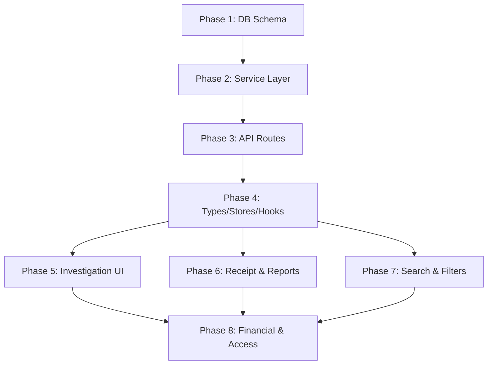

# Infertility Module Overhaul — Implementation Plan

> **Goal**: Make infertility a fully independent department with its own investigations (tests), financial tracking, receipts, reports, and shadow cash management — completely separated from pathology and general-admission money.

---

## Current State Summary

| Aspect | Current State | Target State |
|--------|--------------|--------------|
| **Investigations/Tests** | ❌ None — only medical records | ✅ Same test catalogue as pathology, own `InfertilityTest` DB model |
| **Financial Fields** | ❌ No charges/payments on infertility records | ✅ testCharge, discount, grandTotal, paidAmount, dueAmount per test |
| **Admission Fees** | ❌ 300 BDT auto-charged always in general-admission | ✅ Only charged when patient is actually admitted to hospital |
| **Receipt Printing** | ❌ None | ✅ Same design as pathology receipt but branded "Infertility" |
| **Reports** | ✅ Basic summary/detailed patient report | ✅ Full financial reports matching pathology (summary, detailed, financial, CSV) |
| **Filters** | ✅ Basic search + date range | ✅ Advanced filters (status, doctor, test names) matching pathology |
| **Money Tracking** | ❌ Mixed with general pool | ✅ Completely separate — own ServiceCharge entries tagged `INFERTILITY_TEST` |
| **Shadow Cash** | ❌ None | ✅ Per-receptionist cash-on-hand tracking for infertility collections |
| **Access Control** | ✅ `receptionist-infertility` role exists | ✅ All receptionists get infertility access |

---

## Phase 1: Database Schema Changes

> **Files to modify**: `prisma/schema.prisma`
> **Then run**: `npx prisma migrate dev --name infertility-tests-and-cash`

### Task 1.1: Add `InfertilityTest` Model

Add after the `InfertilityPatient` model (around line 535). This mirrors `PathologyTest` but is linked to `InfertilityPatient` instead:

```prisma
model InfertilityTest {
  id                  Int       @id @default(autoincrement())
  infertilityPatientId Int      // Links to InfertilityPatient
  patientId           Int       // Links to Patient (denormalized for queries)
  testNumber          String    @unique // Format: INFT-YY-XXXXX
  
  // Optional admission link — fees only apply when admitted
  admissionId         Int?

  // Doctor references
  orderedById         Int       // Doctor who ordered
  doneById            Int?      // Staff who performed

  // Test info
  testDate            DateTime  @default(now())
  reportDate          DateTime?
  testCategory        String    // Same categories as pathology
  testResults         Json?     // { tests: ["CBC", "RBS", ...] }
  remarks             String?
  isCompleted         Boolean   @default(false)

  // Financial — independent from pathology
  testCharge          Decimal   @default(0)
  discountType        String?   // "percentage" or "value"
  discountValue       Decimal?
  discountAmount      Decimal?
  grandTotal          Decimal   @default(0)
  paidAmount          Decimal   @default(0)
  dueAmount           Decimal   @default(0)

  // Tracking
  createdAt           DateTime  @default(now())
  updatedAt           DateTime  @updatedAt
  createdBy           Int
  lastModifiedBy      Int

  // Relations
  infertilityPatient  InfertilityPatient @relation(fields: [infertilityPatientId], references: [id])
  patient             Patient            @relation(fields: [patientId], references: [id])
  admission           Admission?         @relation(fields: [admissionId], references: [id])
  orderedBy           Staff              @relation("InfertilityTestOrderedBy", fields: [orderedById], references: [id])
  doneBy              Staff?             @relation("InfertilityTestDoneBy", fields: [doneById], references: [id])

  @@index([infertilityPatientId])
  @@index([patientId])
  @@index([orderedById])
  @@index([testDate])
  @@index([isCompleted])
}
```

### Task 1.2: Add Relations to Existing Models

Add to `Patient` model (around line 39):
```prisma
infertilityTests   InfertilityTest[]
```

Add to `InfertilityPatient` model (around line 529):
```prisma
tests              InfertilityTest[]
```

Add to `Staff` model (around line 85):
```prisma
infertilityTestOrdered  InfertilityTest[] @relation("InfertilityTestOrderedBy")
infertilityTestDone     InfertilityTest[] @relation("InfertilityTestDoneBy")
```

Add to `Admission` model (around line 175):
```prisma
infertilityTests   InfertilityTest[]
```

### Task 1.3: Run Migration

```bash
cd /Users/ashfaq/Dev/FNH-Connect
npx prisma migrate dev --name add-infertility-tests
npx prisma generate
```

---

## Phase 2: Backend Service Layer

> **Files to create/modify**: `src/services/infertilityService.ts`

### Task 2.1: Add Test Query Functions

Add to `infertilityService.ts` after existing exports. Pattern follows `pathologyService.ts`:

```typescript
// New filter interface
export interface InfertilityTestFilters {
  search?: string;
  startDate?: string;
  endDate?: string;
  status?: "Completed" | "Pending" | "All";
  orderedById?: number;
  doneById?: number;
  testNames?: string[];
  infertilityPatientId?: number;
  page?: number;
  limit?: number;
}

export async function getInfertilityTests(filters: InfertilityTestFilters) {
  // Build where clause similar to pathologyService.getPathologyTests
  // Include: patient, infertilityPatient, orderedBy, doneBy
  // Return { data, total, totalPages, currentPage }
}

export async function getInfertilityTestById(id: number) {
  // findUnique with includes
}
```

### Task 2.2: Add Test Mutation Functions

```typescript
export async function createInfertilityTest(
  infertilityPatientId: number,
  testData: { selectedTests: string[], testCharge: number, discountType?, discountValue?, 
              discountAmount?, grandTotal: number, paidAmount: number, dueAmount: number,
              orderedById: number, doneById?: number, remarks?: string, testDate?: string },
  staffId: number,
  userId: number,
  activityLogContext?: ActivityLogContext
) {
  return await prisma.$transaction(async (tx) => {
    // 1. Verify infertility patient exists
    // 2. Generate test number: INFT-YY-XXXXX (same pattern as pathology)
    // 3. Create InfertilityTest record
    // 4. Create ServiceCharge with serviceType "INFERTILITY_TEST" (KEY for financial separation)
    // 5. Log activity
    // Return created test with display info
  });
}

export async function updateInfertilityTest(id, testData, staffId, userId, ctx?) {
  // Similar to pathologyService.updatePathologyTest
  // Update ServiceCharge amounts too
}
```

### Task 2.3: Add Report Data Query

```typescript
export async function getInfertilityTestsForReport(filters: Omit<InfertilityTestFilters, 'page' | 'limit'>) {
  // Same as getInfertilityTests but without pagination (fetch all matching)
  // Used by report generation
}
```

> **Critical**: Every `ServiceCharge` created must use `serviceType: "INFERTILITY_TEST"` — this is what separates infertility money from pathology and admission money in financial reports.

---

## Phase 3: API Routes

### Task 3.1: Create Test List/Create Route

> **File**: `src/app/api/infertility-patients/tests/route.ts`

```typescript
// GET /api/infertility-patients/tests?search=&startDate=&endDate=&status=&page=&limit=
// - Auth check, parse filters, call getInfertilityTests()

// POST /api/infertility-patients/tests
// - CSRF check, auth check, validate body, call createInfertilityTest()
```

### Task 3.2: Create Test Detail Route

> **File**: `src/app/api/infertility-patients/tests/[id]/route.ts`

```typescript
// GET /api/infertility-patients/tests/:id
// PUT /api/infertility-patients/tests/:id — update test
// PATCH /api/infertility-patients/tests/:id — quick status update
```

### Task 3.3: Create Report Data Route

> **File**: `src/app/api/infertility-patients/tests/report/route.ts`

```typescript
// GET /api/infertility-patients/tests/report?...filters (no pagination)
// Returns all matching tests for PDF/CSV generation
```

### Task 3.4: Validation Schemas

> **File**: `src/app/(authenticated)/infertility/types/schemas.ts` — add new schemas:

```typescript
export const infertilityTestFiltersSchema = z.object({
  search: z.string().optional(),
  startDate: z.string().optional(),
  endDate: z.string().optional(),
  status: z.enum(["Completed", "Pending", "All"]).optional(),
  orderedById: z.coerce.number().optional(),
  doneById: z.coerce.number().optional(),
  testNames: z.array(z.string()).optional(),
  page: z.coerce.number().min(1).default(1),
  limit: z.coerce.number().min(1).max(100).default(15),
});

export const createInfertilityTestSchema = z.object({
  infertilityPatientId: z.number(),
  selectedTests: z.array(z.string()).min(1),
  testCharge: z.number().min(0),
  discountType: z.enum(["percentage", "value"]).nullable().optional(),
  discountValue: z.number().nullable().optional(),
  discountAmount: z.number().default(0),
  grandTotal: z.number().min(0),
  paidAmount: z.number().min(0),
  dueAmount: z.number().min(0),
  orderedById: z.number(),
  doneById: z.number().nullable().optional(),
  remarks: z.string().optional(),
  testDate: z.string().optional(),
});
```

---

## Phase 4: Frontend Types, Stores & Hooks

### Task 4.1: Extend Types

> **File**: `src/app/(authenticated)/infertility/types/index.ts` — add:

```typescript
// Mirror PathologyInfo from pathology/types
export interface InfertilityTestInfo {
  selectedTests: string[];
  testCharge: number;
  discountType: "percentage" | "value" | null;
  discountValue: number | null;
  discountAmount: number | null;
  grandTotal: number;
  paidAmount: number;
  dueAmount: number;
  testDate: string;
  testCategory: string;
  remarks: string;
  isCompleted: boolean;
  orderedById: number | null;
  doneById: number | null;
}

// Table data type for test records
export interface InfertilityTestData {
  id: number;
  infertilityPatientId: number;
  patientId: number;
  testNumber: string;
  patientFullName: string;
  patientGender: string;
  patientAge: number | null;
  patientDOB: string | null;
  mobileNumber: string | null;
  caseNumber: string;
  testDate: string;
  reportDate: string | null;
  testCategory: string;
  testResults: any;
  remarks: string | null;
  isCompleted: boolean;
  testCharge: number;
  discountType: string | null;
  discountValue: number | null;
  discountAmount: number | null;
  grandTotal: number;
  paidAmount: number;
  dueAmount: number;
  orderedById: number;
  orderedBy: string | null;
  doneById: number | null;
  doneBy: string | null;
  createdAt: string;
  updatedAt: string;
  createdBy: number;
  lastModifiedBy: number;
}

export interface InfertilityTestFilters {
  search?: string;
  startDate?: string;
  endDate?: string;
  status?: "Completed" | "Pending" | "All";
  orderedById?: number;
  doneById?: number;
  testNames?: string[];
  page?: number;
  limit?: number;
}
```

### Task 4.2: Create Test Filter Store

> **File**: `src/app/(authenticated)/infertility/stores/testFilterStore.ts`

Pattern: Copy `src/app/(authenticated)/pathology/stores/filterStore.ts` and adapt:
- Rename all `pathology` references to `infertility`
- Keep same filter fields: search, status, startDate, endDate, orderedById, doneById, testNames, dateRange
- Same pagination state

### Task 4.3: Create Test Form Store

> **File**: `src/app/(authenticated)/infertility/stores/testFormStore.ts`

Pattern: Copy pathology `formStore.ts` and adapt:
- Store `infertilityPatientId` (which patient this test is for)
- Same test selection, financial fields, doctor dropdowns

### Task 4.4: Update Store Index

> **File**: `src/app/(authenticated)/infertility/stores/index.ts` — add exports for new stores

### Task 4.5: Create Hooks

New hooks to add to `src/app/(authenticated)/infertility/hooks/`:

| Hook File | Purpose | Pattern Source |
|-----------|---------|---------------|
| `useFetchInfertilityTests.ts` | SWR hook for test list | `pathology/hooks/useFetchPathologyData.ts` |
| `useAddInfertilityTest.ts` | Mutation for creating test | `pathology/hooks/useAddPathologyData.ts` |
| `useEditInfertilityTest.ts` | Mutation for editing test | `pathology/hooks/useEditPathologyData.ts` |
| `useFetchInfertilityTestReport.ts` | Fetch all for reports | `pathology/hooks/useFetchPathologyReportData.ts` |
| `useFetchDoctors.ts` | Doctor dropdown | `pathology/hooks/useFetchDoctors.ts` |

Update `src/app/(authenticated)/infertility/hooks/index.ts` with new exports.

---

## Phase 5: Frontend Components — Investigations UI

### Task 5.1: Create Constants File

> **File**: `src/app/(authenticated)/infertility/constants/infertilityTests.ts`

```typescript
// Re-export the SAME test catalogue from pathology
export { PATHOLOGY_TESTS as INFERTILITY_TESTS, PATHOLOGY_CATEGORIES as INFERTILITY_CATEGORIES, 
         getTestByCode, getTestsByCategory, calculateTotalPrice } from "../../pathology/constants/pathologyTests";
```

This ensures both modules share the same test list. If infertility needs extra tests later, they can be added here.

### Task 5.2: Add Test Form Section to AddNewData Modal

> **File**: `src/app/(authenticated)/infertility/components/form-sections/InvestigationInformation/` (new directory)

Create component that allows:
1. Multi-select test picker (same UI as pathology's `PathologyInformation` form section)
2. Auto-calculates testCharge from selected tests
3. Discount fields (percentage/value)
4. GrandTotal, PaidAmount, DueAmount
5. Doctor dropdown (orderedBy)
6. Remarks field

### Task 5.3: Add Test Form to AddNewDataInfertility

> **File**: `src/app/(authenticated)/infertility/components/AddNewData/AddNewDataInfertility.tsx`

Add the new InvestigationInformation section as an optional expandable accordion below existing medical info. The test is submitted as a separate API call after patient creation.

### Task 5.4: Create Investigations Tab/View

> **File**: `src/app/(authenticated)/infertility/components/InvestigationsTable/` (new directory)

Create a table component similar to pathology's `PatientTable` that shows:
- Test number, date, tests performed, status, financial summary
- Edit button → opens test edit modal
- Print receipt button → calls `generateInfertilityReceipt()`

### Task 5.5: Update Main Page with Tab Navigation

> **File**: `src/app/(authenticated)/infertility/page.tsx`

Add tab system: **Patients** | **Investigations**
- Patients tab = existing table
- Investigations tab = new test records table with full filter/search/report bar

---

## Phase 6: Receipt & Report Generation

### Task 6.1: Investigation Receipt

> **File**: `src/app/(authenticated)/infertility/utils/generateInvestigationReceipt.ts`

Copy `pathology/utils/generateReceipt.ts` and modify:
- Change title from `"INVOICE"` to `"INFERTILITY INVESTIGATION INVOICE"`
- Change subtitle/department to `"Infertility Management Unit"`
- Keep same layout: logo, patient info box, test table, totals, DUE stamp
- Use `InfertilityTestData` type instead of `PathologyPatientData`
- Import tests from `../constants/infertilityTests` instead of pathology constants

### Task 6.2: Financial Report

> **File**: `src/app/(authenticated)/infertility/utils/generateInvestigationReport.ts`

Copy `pathology/utils/generateReport.ts` and modify:
- All titles: "Infertility Investigation Summary Report" / "Detailed Infertility Investigation Report"
- Same metric boxes: Total Tests, Completed, Pending, Completion Rate, Test Charges, Discount, Net Revenue, Collection Rate, Collected, Due
- Same Individual Tests Breakdown table
- Same Doctor-wise Breakdown table
- Same Detailed Records table (for detailed type)
- Use `InfertilityTestData` type

### Task 6.3: CSV Export

> **File**: `src/app/(authenticated)/infertility/utils/exportToCSV.ts`

Copy `pathology/utils/exportToCSV.ts`, change column headers to match infertility test data.

---

## Phase 7: Search, Filters & Export Bar

### Task 7.1: Upgrade InfertilitySearch

> **File**: `src/app/(authenticated)/infertility/components/InfertilitySearch.tsx`

Replace current simple search with full version matching `PathologySearch.tsx`:
- Search input (debounced)
- `FilterTriggerButton` (opens slide-out filter panel)
- `ReportTriggerButton` with dropdown: Summary, Detailed, Financial, Export CSV
- Report generation calls `fetchAllDataForReport()` then generates PDF/CSV

### Task 7.2: Create Filter Panel

> **File**: `src/app/(authenticated)/infertility/components/filter/Filters.tsx`

Copy `pathology/components/filter/Filters.tsx` and adapt:
- Same slide-out panel with filters:
  - Status: All / Completed / Pending
  - Date Range picker
  - Ordered By (doctor dropdown)
  - Done By (staff dropdown)
  - Test Names (multi-select from INFERTILITY_TESTS)

### Task 7.3: Create Filter Components

> **Directory**: `src/app/(authenticated)/infertility/components/filter/components/`

Copy from pathology:
- `FilterTriggerButton.tsx` — pill button to open filter panel
- `ReportTriggerButton.tsx` — updated with all 4 options (summary, detailed, financial, CSV)
- `ExportActionBar.tsx` — floating bar when filters active

### Task 7.4: Update Filter Index

> **File**: `src/app/(authenticated)/infertility/components/filter/index.ts`

```typescript
export { Filters } from "./Filters";
export { FilterTriggerButton } from "./components/FilterTriggerButton";
export { ReportTriggerButton } from "./components/ReportTriggerButton";
export { ExportActionBar } from "./components/ExportActionBar";
```

---

## Phase 8: Financial Separation & Access Control

### Task 8.1: Financial Separation in Backend

All infertility test charges use `serviceType: "INFERTILITY_TEST"` in `ServiceCharge`.

The existing `ServiceCharge` model already supports this via the `serviceType` field. No schema change needed — just ensure all infertility service code uses this type consistently.

Dashboard and admin reports should filter by `serviceType` to separate:
- `"PATHOLOGY_TEST"` → pathology money
- `"ADMISSION_FEE"`, `"OPERATION"`, etc. → general admission money
- `"INFERTILITY_TEST"` → infertility money

### Task 8.2: Shadow Cash Tracking

The existing `Shift` + `CashMovement` + `Payment` models already support per-staff cash tracking. For infertility-specific tracking:

**Option A (Recommended)**: Add a `source` or `department` field to `Payment`:
```prisma
// Add to Payment model
department  String?  // "PATHOLOGY", "ADMISSION", "INFERTILITY"
```

Then filter payments by department for per-department cash reconciliation.

**Option B**: Tag `CashMovement` with department info via the `description` field or a new `department` column.

### Task 8.3: Update Dashboard API

> **File**: `src/app/api/dashboard/route.ts`

Add infertility stats section that queries:
```sql
-- Infertility-specific financials
SELECT SUM(grandTotal), SUM(paidAmount), SUM(dueAmount), COUNT(*)
FROM "InfertilityTest"
WHERE testDate >= [period_start]
```

### Task 8.4: Receptionist Access Update

> **File**: `src/lib/roles.ts`

Current state: `receptionist-infertility` role already exists and grants infertility access.

Change needed: **All receptionists** should now access infertility:

```typescript
// Update RECEPTIONIST_ALLOWED_ROUTES (line 42-47)
export const RECEPTIONIST_ALLOWED_ROUTES = [
  "/dashboard",
  "/general-admission",
  "/pathology",
  "/patient-records",
  "/infertility",        // ADD THIS
  "/api/infertility",    // ADD THIS
];
```

> **File**: `src/components/sidebar/navigation.ts`

```typescript
// Update RECEPTIONIST_SIDEBAR_ROUTES (line 22-27)
const RECEPTIONIST_SIDEBAR_ROUTES = [
  "/dashboard",
  "/general-admission",
  "/pathology",
  "/patient-records",
  "/infertility",  // ADD THIS
];
```

### Task 8.5: Admission Fee Conditional Logic

> **File**: `src/services/admissionService.ts` (or wherever admission fee is auto-applied)

The 300 BDT `DEFAULT_ADMISSION_FEE` should only be charged when a patient is actually admitted via the General Admission flow. Since infertility patients have their own flow, the fee is NOT automatically added.

In the infertility UI, add an "Admit Patient" action that:
1. Creates an `Admission` record linking to the infertility patient
2. Only then applies the 300 BDT fee
3. Unlocks the admission-related fee fields (service charge, seat rent, OT charge, etc.)

---

## Implementation Order & Dependencies



## Files Changed/Created Summary

### New Files (≈20)
| File | Description |
|------|-------------|
| `infertility/constants/infertilityTests.ts` | Re-exports pathology test catalogue |
| `infertility/stores/testFilterStore.ts` | Zustand store for investigation filters |
| `infertility/stores/testFormStore.ts` | Zustand store for test creation form |
| `infertility/hooks/useFetchInfertilityTests.ts` | SWR hook for test list |
| `infertility/hooks/useAddInfertilityTest.ts` | Mutation hook for test creation |
| `infertility/hooks/useEditInfertilityTest.ts` | Mutation hook for test update |
| `infertility/hooks/useFetchInfertilityTestReport.ts` | Report data fetch hook |
| `infertility/hooks/useFetchDoctors.ts` | Doctor list for dropdowns |
| `infertility/components/form-sections/InvestigationInformation/` | Test selection form |
| `infertility/components/InvestigationsTable/` | Test records table |
| `infertility/components/filter/Filters.tsx` | Slide-out filter panel |
| `infertility/components/filter/components/FilterTriggerButton.tsx` | Filter button |
| `infertility/components/filter/components/ExportActionBar.tsx` | Export floating bar |
| `infertility/utils/generateInvestigationReceipt.ts` | PDF receipt for tests |
| `infertility/utils/generateInvestigationReport.ts` | PDF financial report |
| `infertility/utils/exportToCSV.ts` | CSV export utility |
| `api/infertility-patients/tests/route.ts` | List + Create API |
| `api/infertility-patients/tests/[id]/route.ts` | Get + Update API |
| `api/infertility-patients/tests/report/route.ts` | Report data API |

### Modified Files (≈8)
| File | Change |
|------|--------|
| `prisma/schema.prisma` | Add `InfertilityTest` model + relations |
| `src/services/infertilityService.ts` | Add test CRUD functions |
| `infertility/types/index.ts` | Add test-related types |
| `infertility/types/schemas.ts` | Add test validation schemas |
| `infertility/stores/index.ts` | Export new stores |
| `infertility/hooks/index.ts` | Export new hooks |
| `infertility/page.tsx` | Add tabs: Patients / Investigations |
| `src/lib/roles.ts` | Grant all receptionists infertility access |
| `src/components/sidebar/navigation.ts` | Update sidebar routes |

---

## Rate Limiting Strategy

Each phase should be implemented in **1-2 PRs max**. Within each phase:
- Do schema + service together (Phase 1+2 = 1 session)
- Do API routes (Phase 3 = 1 session)  
- Do types/stores/hooks (Phase 4 = 1 session)
- Do UI components one at a time (Phase 5 = 2-3 sessions)
- Do receipts/reports (Phase 6 = 1 session)
- Do filters (Phase 7 = 1 session)
- Do access/financial (Phase 8 = 1 session)

**Total: ~8-10 implementation sessions**
